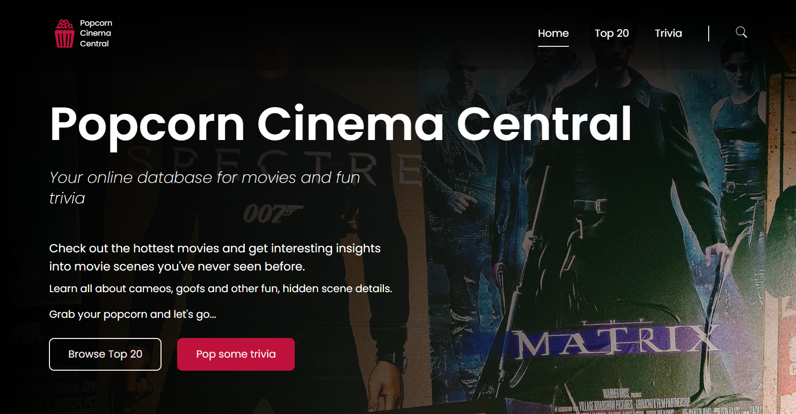

# Popcorn Cinema Central 

This is an online movie database with data from an IMDB-API including lots of fun facts about movies - well that's the plan ;)

The reason why I started this project was, because I wanted to dive deeper into Tailwind and getting more experience working with it.

Check out the latest version:
[popcorn-cinema-central.onrender.com)](https://popcorn-cinema-central.onrender.com/)

## Screenshots




## Tech Stack

**Client:** React, JavaScript, CSS, TailwindCSS


## Author

 [@MoniqueHeusinger](https://www.github.com/MoniqueHeusinger)


## Run Locally

1) Clone the project

```bash
  git clone https://github.com/MoniqueHeusinger/Movie-Database-PCC.git
```

2) Go to the project directory

```bash
  cd movie-database-pcc/frontend
```

3) Install dependencies

```bash
  npm install
```

4) Start the server

```bash
  npm run dev
```


## Environment Variables

To run this project, you will need to add the following environment variable to your .env file

`VITE_API_KEY_MOVIEDB`

Then get your free API-KEY on rapid.com (https://rapidapi.com/apidojo/api/imdb8) and copy it into your .env file.


## Deployment

[popcorn-cinema-central.onrender.com)](https://popcorn-cinema-central.onrender.com/)


